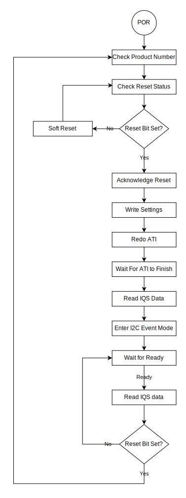

# IQS323 Arduino Example Code

## Introduction

This Arduino example code demonstrates how to set up and use the IQS323
Integrated Circuit (IC). The IQS323  is a 3 Channel Self-Capacitive / 3
Channel Mutual-Capacitive / 2 Channel Inductive sensing controller with Touch
and Proximity user interfaces. This example code accommodates all 3 IQS323
Evaluation Kits.

This example code is intended for an Arduino Compatible board that uses 3.3 V
logic, such as
[Sparkfun's Pro Micro (3.3V, 8 MHz)](https://learn.sparkfun.com/tutorials/pro-micro--fio-v3-hookup-guide/hardware-overview-pro-micro).
If a 5V logic Arduino board is used, a logic-level translator will be required
between the Arduino-based board and the IQS323.

## Arduino Code Configuration

The behaviour and pin assignments of the Arduino code can be configured with the
`#define` settings at the start of `iqs323-example-code.ino`.

In the example code folder, go to file: `src/IQS323.h`. Change the value of the
define to the number of the specific IQS323 EV-KIT the Arduino project needs to
be compiled for.

```c
/* Select the EV-Kit below by changing the value of the define (default = 0):
 * 0: Inductive Options EV-Kit (AZP1212A3).
 * 1: Slider EV-Kit (AZP1209A4).
 * 2: 3-Projected Buttons EV-Kit (AZP1210A4).
 */
#define IQS323_EV_KIT   0
```

Change the following pin assignments and parameters to suit your hardware:

```c
/*** Defines ***/
#define DEMO_IQS323_ADDR                      0x44
#define DEMO_IQS323_POWER_PIN                 4
#define DEMO_IQS323_RDY_PIN                   7
```

* `DEMO_IQS323_ADDR` is the IQS323 I2C Slave address. For more information,
refer to the datasheet and application notes found on the [IQS323 Product Page](https://www.azoteq.com/product/iqs323/).

* `DEMO_IQS323_POWER_PIN` can be used to power the IQS323 directly from
  an Arduino GPIO.
  This parameter sets which pin to use.
  This is an optional setting and can be removed if the IQS323 is powered
  from the VCC pin or an external power supply.

* `DEMO_IQS323_RDY_PIN` sets the pin assignment for the IQS323 ready pin.
  This must support external interrupts.
  On the SparkFun Pro Micro, pins 0, 1, 2, 3, and 7 support interrupts.

> :memo: **Note:** Please note that powering an IQS device directly from a GPIO is _generally_ not recommended. However, the `DEMO_IQS323_POWER_PIN` in this example could be used as an enable input to a voltage regulator.

## Example Code Flow Diagram

<p align="center">
  
</p>

## SparkFun Board Library Installation

To use the SparkFun Pro Micro, the SparkFun Board Library must be installed
in the Arduino IDE.

Add the SparkFun Board Library by opening Preferences (*File* > *Preferences*),
and paste the following URL into the "Additional Board Manager URLs" text box.

```
https://raw.githubusercontent.com/sparkfun/Arduino_Boards/master/IDE_Board_Manager/package_sparkfun_index.json
```


Click "OK".
Then open the Board Manager under **Tools** > **Board** > **Boards Manager...**.


Search for "SparkFun", and install "SparkFun AVR Boards by SparkFun".


You can now select the "SparkFun Pro Micro" in the Board selection menu.


Also be sure to select the "3.3 V, 8 MHz" version under *Tools* > *Processor*.


Source: [Pro Micro Hookup Guide](https://learn.sparkfun.com/tutorials/pro-micro--fio-v3-hookup-guide)

## Serial Communication and Interface
The example code provides verbose serial feedback to aid users in the
demonstration of start-up and operational functions. It also has two built-in
commands to demonstrate IQS323's functionality. To use the built-in
commands, the user simply sends an 'f' or 'r' over the serial
interface.

`1 - "f\n" - Force open a communication(RDY) window`


`2 - "r\n" - Request a Software Reset during runtime`

It is important to take note of the newline ('\n') character that is needed to
complete any serial request. It can be activated in the built-in Arduino IDE
Serial monitor, shown inside the blue rectangle in the figure below.


